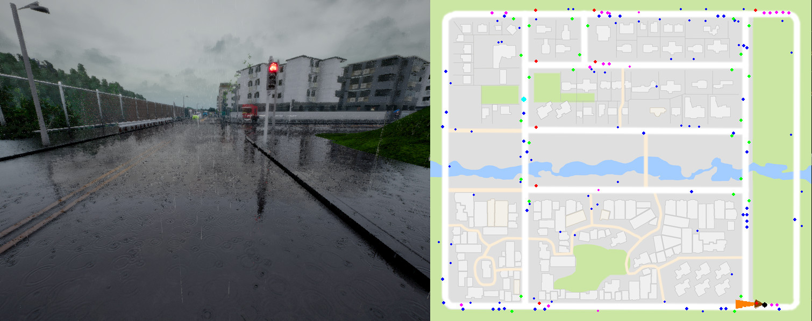

Collecting Data
===============

For all the examples here assume there is a CARLA Gear server listening on port 2000.

#### Debug mode

To see the debug screen above showing all the non player agents:

    python3 collect.py -db -dp -dv -dt

##### Toggling other agents view

###### Pedestrians

To show only pedestrians:

    python3 collect.py -db -dp

Small blue dots: pedestrians walking outside the road.

Small pink dots: pedestrians walking on the road.

###### Vehicles

To show only vehicles:

    python3 collect.py -db -dv

Medium sized blue dots: vehicles on a different lane.

Medium sized pink dots: vehicles on the same lane.

###### Traffic Lights

To show only traffic lights:

    python3 collect.py -db -dt

Green dots: green traffic lights.

Red dots: red traffic lights.

#### Changing data output folder

To set the folder for placing the data:

    python3 collect.py  --data-path ~/Datasets/AmazingData

#### Selecting dataset configuration

To change the sensor/episodes/noise configuration of your
data collection you can run:

    python3 collect.py  --data-configuration-name coil_training_dataset

